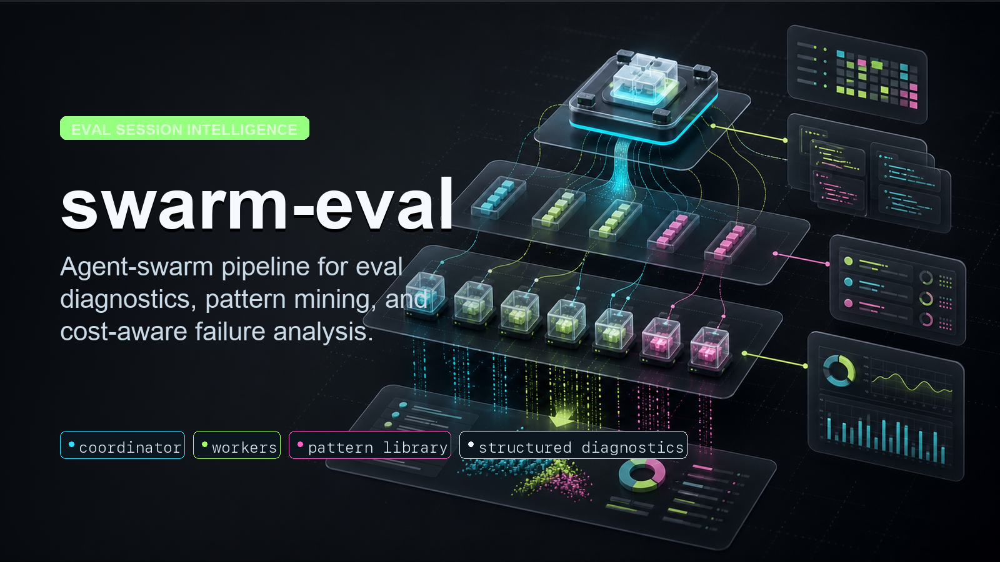

# swarm-eval

Agent-swarm pipeline that analyzes eval session files (locomo10 first; designed
for reuse on future eval datasets) and emits **structured failure-pattern
classifications**, **expensive-but-correct diagnostics**, plus a growing
**pattern library**.

- **Coordinator** — 1 long-running coordinator process, holds persistent state in
  `pattern_store.db`, runs reflection loops to add/refine/dismiss patterns and
  resolve worker escalations.
- **Workers** — N ephemeral worker calls, single-shot per session,
  classify-and-output-JSON. Concurrency capped by `asyncio.Semaphore`.
- **Runtimes** — worker and coordinator calls go through a swappable runtime
  interface. Claude Code, Codex, and OpenCode can be selected independently for
  workers/coordinator. The current Codex defaults are `gpt-5.5` workers and
  `gpt-5.5` coordinator with low reasoning effort; override with
  `--worker-model`, `--coordinator-model`, `SWARM_CODEX_WORKER_REASONING`, or
  `SWARM_CODEX_COORDINATOR_REASONING`.
- **Pattern library grows** as the run progresses. Workers see the latest
  library in their system prompt at call-time. Library is persisted, so a
  re-run of a similar dataset starts warm.

Built by @zeus, reviewed by @tim, methodology to be approved by @hela.

## Layout

```
swarm-eval/
├── src/
│   ├── linker.py            transcripts ↔ qa_results join
│   ├── pattern_store.py     SQLite CRUD + system-prompt builder
│   ├── prompts/
│   │   ├── worker.md        haiku worker system prompt template
│   │   └── coordinator.md   opus coordinator system prompt template
│   ├── backends/
│   │   ├── base.py          unified agent-runtime interface
│   │   ├── factory.py       runtime selector / aliases
│   │   ├── cli.py           Claude Code `claude -p` subprocess
│   │   ├── codex.py         Codex `codex exec` runtime
│   │   ├── sdk.py           Anthropic Python SDK direct API (needs ANTHROPIC_API_KEY)
│   │   └── opencode.py      OpenCode `opencode run` runtime
│   ├── worker.py
│   ├── coordinator.py
│   ├── orchestrator.py      asyncio glue: queue, semaphore, reflection loop, final sweep
│   ├── summarize.py         markdown digest generator
│   └── cli.py               `python3 src/cli.py run --result-dir ... --limit N`
├── runs/<run-id>/
│   ├── pattern_store.db     final patterns + escalations + session_results
│   ├── results.jsonl        full event log (worker/sweep/reflection)
│   └── digest.md            human-readable summary
└── docs/DESIGN.md           architecture (prompts, queues, decisions)
```

## Run

```bash
# 1) link transcripts to QA rows (sanity check on a new dataset)
python3 src/cli.py dry-link --result-dir /path/to/result-dir --limit 20

# 2) sample run
python3 src/cli.py run \
  --result-dir /path/to/result-dir \
  --limit 100 \
  --concurrency 20 \
  --runtime claude-code \
  --reflect-every-n 50 \
  --run-id n100-test

# 2b) failure-pattern run with CORRECT calibration sample
python3 src/cli.py run \
  --result-dir /path/to/result-dir \
  --scope wrong-plus-correct-calibration \
  --correct-sample-per-bucket 10 \
  --runtime sdk \
  --worker-max-tokens 700 \
  --run-id wrong-calibration-test

# 2c) split runtimes if needed
python3 src/cli.py run \
  --result-dir /path/to/result-dir \
  --worker-runtime codex \
  --coordinator-runtime codex \
  --worker-model gpt-5.5 \
  --coordinator-model gpt-5.5 \
  --scope wrong-plus-correct-calibration \
  --output-dir runs \
  --run-id codex-swarm-smoke

# 3) generate digest
python3 src/summarize.py runs/n100-test --out runs/n100-test/digest.md

# 4) second-pass hook recall quality analysis (WRONG sessions only)
python3 src/hook_recall_analysis.py \
  --result-dir /path/to/result-dir \
  --runtime codex \
  --concurrency 4 \
  --run-id hook-recall-wrong-only

# 5) third-pass tmux journal workflow-pattern swarm
python3 src/tmux_journal_analysis.py \
  --journal-dir ~/.tmux-journal \
  --runtime codex \
  --worker-model gpt-5.5 \
  --coordinator-model gpt-5.5 \
  --concurrency 2 \
  --run-id tmux-journal-gpt55-low

# 6) SWE-ContextBench context-value taxonomy swarm
python3 src/swe_contextbench_analysis.py \
  --dataset-dir /Users/bytedance/code/c/SWEContextBench \
  --runtime codex \
  --worker-model gpt-5.3-codex-spark \
  --coordinator-model gpt-5.5 \
  --max-chars-per-chunk 250000 \
  --concurrency 3 \
  --run-id swectx-full-gpt55-spark
```

The orchestrator is **resume-safe**: re-running with the same `--run-id` skips
already-classified sessions. Useful if a long run is interrupted (machine
sleep, kill, OOM).

## Interpreting outputs

`runs/<run-id>/digest.md` has:

- **headline** — sessions analyzed, verdict distribution, parse errors
- **seed → final pattern diff** — which seed patterns survived, which were
  dismissed, what new patterns the coordinator added
- **patterns table** — every pattern with count, symptom, rule, example sessions
- **WRONG failure patterns** — direct view of bad-answer pattern coverage
- **CORRECT high-cost/token patterns** — direct view of expensive-but-correct causes
- **top expensive CORRECT sessions** — cost/token outliers with worker notes
- **escalations** — worker questions and coordinator resolutions
- **coverage by bucket** — `unknown%` of WRONG cases by `(num_turns, ov_mcp_calls)` bucket; if any bucket exceeds ~30% the library has gaps and prompt iteration is warranted before scaling further
- **per-session table** — flat list with grader vs worker verdicts, primary pattern, severity, confidence

`runs/<run-id>/hook_recall_digest.md` is a separate second-pass report for
grader-WRONG sessions. It asks whether hook-injected recall context already
contained enough information to answer the gold answer, and separates:

- `sufficient` — hook recall worked; final answer extraction/reasoning failed
- `partial` / `absent` — hook recall missed required information
- `misleading` — hook recall surfaced distractors or wrong-window evidence
- `unassessable` — hook context is too truncated/ambiguous to judge

`runs/<run-id>/tmux_journal_digest.md` is a separate third-pass report for
tmux-journal logs. Workers analyze redacted pane chunks, then the coordinator
merges recurring workflow, tooling, verification, automation, and memory-quality
patterns into user-facing insight.

`runs/<run-id>/swe_contextbench_digest.md` is a separate report for
SWE-ContextBench. A coordinator first samples related/experience task pairs and
creates seed tags, workers then read full related-task plus linked
experience-task text, and the final coordinator merges worker tags into a
context-value taxonomy with case IDs and token usage by role/model.

## Plugging a new eval dataset

`linker.py` is the only dataset-shape contact point. It expects:

| Required artifact | Used for |
|---|---|
| `transcripts/*.jsonl` per session | event stream (assistant turns, tool calls, hook injections) |
| `qa_results.csv` | ground truth + grader verdict + runtime metrics |
| `cwd` field in transcript JSONL ending in `<sample_id>/` | session ↔ QA join key |
| First user message containing the question text | secondary join key |

If your new dataset matches that shape, no code changes needed — just point
`--result-dir`. If different, edit `linker.py:iter_linked` and
`linker.py:render_session_payload`.

`run_context` (read from `summary.txt` + `experiment_report.md` in the result
dir) is fed into the coordinator as background. If your new dataset has
different metadata, drop equivalent files in.

`SEED_PATTERNS` in `orchestrator.py` are dataset-agnostic priors. They survive
across datasets because the coordinator can dismiss any that don't apply.

## Runtime tradeoffs

`python3 src/cli.py runtimes` prints the installed selector names and default
models. `--runtime X` sets both roles; `--worker-runtime` and
`--coordinator-runtime` can split them.

| runtime | how | output cap | when to use |
|---|---|---|---|
| `sdk` | Anthropic Python SDK | hard `max_tokens` | delivery runs when `ANTHROPIC_API_KEY` is set |
| `claude-code` (`cli`, `claude`) | `claude -p --model <id>` subprocess | prompt-side only | OAuth subscription fallback |
| `codex` | `codex exec` non-interactive subprocess | prompt-side only | compare OpenAI/Codex runtime behavior |
| `opencode` | `opencode run --format json` subprocess | prompt-side only | compare OpenCode/provider behavior |

n=100 reference numbers (CLI backend, Haiku 4.5):
- ~3 minutes wall (c=20)
- 1.06K input / 3.5M cache_read / 293K output tokens
- ~$1.80 total
- 100% grader-verdict agreement, 0 parse errors, 0 unknowns post final-pass sweep

Extrapolation to 1540 sessions: ~50min wall, ~$28 total.

## Reflection

By default, worker prompts use a frozen pattern library during the run, and the
coordinator runs one post-run reflection before the bounded final sweep. This
keeps prompt size stable and prevents mid-run pattern-library growth from
inflating worker output.

If `--midrun-reflection` is enabled, the coordinator runs Opus reflection when
ANY of:
- `unresolved_escalations >= 5` (responsive)
- `sessions_done_since_last_reflection >= 50` (batch)
- `unresolved_escalations > 0 AND idle >= 240s` (gated time fallback)

All gated by a minimum 30s spacing. Tunable via `RunConfig` fields.

## Final-pass sweep

After the main run, sessions whose worker classification is `unknown` OR whose
confidence is below `final_sweep_low_conf` (default 0.6) are re-run **once**
against the **final** pattern library. Capped at `final_sweep_max_sessions`
(default 200). Result is only overwritten if it improves the classification.

This replaces the older retry-with-versioning approach. Cleaner, bounded, single-pass.

## Cost / state controls

- `--concurrency` — semaphore cap on in-flight API calls. `c=20` works on a
  Mac with the CLI backend; bump higher with SDK + API key.
- `--runtime` — runtime for both worker and coordinator.
- `--worker-runtime` / `--coordinator-runtime` — split the worker pool and
  coordinator across runtimes. Supported selectors mirror the daemon runtimes
  needed here: `claude-code`, `codex`, `opencode`, plus `sdk`.
- `--output-dir` — base directory for per-run artifacts. Defaults to `runs`;
  the selected `--run-id` is appended.
- `--limit` — cap on sessions linked from the dataset (omit for full).
- `--scope wrong-only` — analyze only grader-WRONG rows.
- `--scope wrong-plus-correct-calibration` — analyze all WRONG rows plus a
  deterministic CORRECT sample, stratified by 4 turn buckets × 2 MCP buckets.
  The MCP bucket uses `max(ov_mcp_calls, transcript-derived mcp__* tool_use
  count)` so metric undercount does not collapse the sample. Empty CORRECT
  buckets are not backfilled.
- `--worker-max-tokens` — server-side output cap for SDK backend. The CLI
  and agent-CLI runtimes accept this setting for interface parity but do not
  enforce it server-side.
- `--reflect-every-n` — sessions between reflections.
- `--midrun-reflection` — opt back into live pattern evolution. Leave off for
  cost-controlled runs.
- `pattern_store.db` is persistent; deleting the file resets the library.
- Cost shows up in token counts (per-call) in `results.jsonl` and aggregated in
  the digest. For Codex CLI calls, the wrapper records the total token count
  printed by `codex exec` stderr; granular input/cache/output fields remain
  zero unless the runtime exposes them.
- `SWARM_CODEX_TIMEOUT_S` can raise the Codex subprocess timeout for very large
  SWE-ContextBench chunks that need more than the default 300 seconds.
- Circuit breaker aborts the run if workers or reflections hit repeated backend
  failures, then skips final reflection/sweep so a bad backend does not produce
  a clean-looking digest.

## Runtime Health Loop

Runtime throttling or repeated CLI failures are currently handled by the
orchestrator/supervisor layer, not by the semantic coordinator. The existing
flow is:

1. workers write every backend error into `results.jsonl`
2. circuit breaker aborts when consecutive/rolling failures cross the configured
   thresholds
3. rerunning with the same `--run-id` resumes by skipping already-classified
   sessions
4. the operator can lower `--concurrency` or adjust circuit-breaker thresholds
   for the resume pass

For a fully general swarm workflow, the next step is to make this adaptive:
record throttle/error classes as runtime-health events, automatically reduce
concurrency/back off, then resume the queue without human intervention. The
semantic coordinator should continue to own pattern-library evolution; the
runtime supervisor should own throttling and recovery policy.

## Known limitations

- Agent CLI runtimes (`claude-code`, `codex`, `opencode`) can't guarantee
  `max_tokens` server-side in this wrapper. Switch to `sdk` for hard Anthropic
  output enforcement.
- Mid-run reflection is opus-driven and expensive. It also grows the worker
  prompt library during the run, which can inflate worker outputs. Keep it
  disabled unless the run explicitly needs live pattern evolution.
- Pattern library is currently global (not partitioned by dataset). Re-using
  the same pattern_store.db across very different datasets will pollute. New
  dataset → new run-id (= new db).
